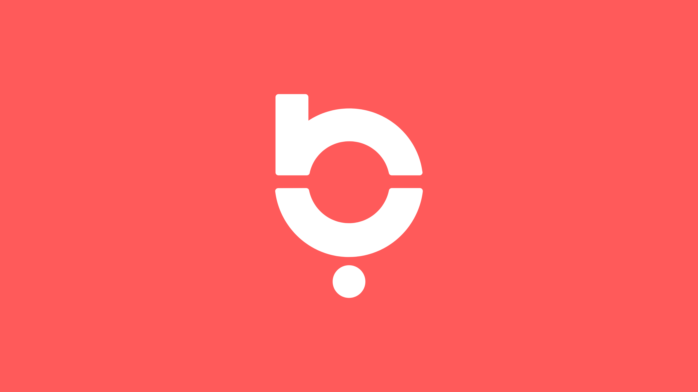

- باز هي منصة وسائل تواصل اجتماعية تم إنشاؤها خصيصا للعالم العربي. ويوفر للمستخدمين تبادل المعلومات ويخلق بيئة امنة وواقعية لتبادل الثقافي مما يعكس الثقافة العربية.

- وحتى تقدر منصة باز توفر بيئة آمنة للمستخدمين ومحتوى ملائم استخدموا طرق كثيرة للتحقق من المستخدمين او ما يسمى(identity verification) باستخدام عملية "اعرف عميلك" وهي الKYC وبالشراكة مع Shufti Pro اللي بتستخدم اكثر من ٩٠٠ خوارزمية ذكاء اصطناعي للحصول على افضل نتائج و طريقة KYC مستخدمة ايضا في البنوك والمواقع الشراء الالكترونية لمنع الاحتيال والجرائم الالكترونية.

- لو تخيلنا ان عملية التحقق من جميع المستخدمين بطريقة يدوية،فمثلا عملية التحقق من صورة ومن جودتها او التحقق من المعلومات المدخلة وادخالها يدويا سيأخذ وقتا كبيرا واحتمالية خطأ عالية.

- لذلك تم ادخال الذكاء الاصطناعي في عملية اعرف عمليك (KYC) وباستخدام التعلم العميق يستطيع التحقق من الصور المدخلة وجودتها ويستطيع التحقق من المعلومات المدخلة...بس كيف بتم هذا الاشي؟!

- باستخدام تقنية التعرف على الاشياء (object detection) وباستخدام التعرف الضوئي على الحروف (OCR) وهيك بنقدر نتأكد من البيانات المدخلة والملفات المرفقة وصحة هاي المعلومات من خلال الكشف على النصوص والاحرف وتحليلها.

- واستخدام الرؤية الحاسوبية (computer vision) ساعدنا من التحقق من جودة الصورة المدخلة من المستخدم واعطاء تغذية راجعة عن الصورة "مثلا الصورة مصورة بالاتجاه الخاطئ "وهيك بقدر المستخدم يغير الصورة بسرعة اكبر وما يستنى تغذية راجعة يدوية ممكن توخذ ايام واسابيع وما تكون بالدقة الموجودة بالرؤية الحاسوبية.

- كل الطرق اللي تم ذكرها فوق جزء من عالم الذكاء الاصطناعي اللي بقدر يقللي نسبة التدخل البشري لاكثر من ٨٥% فبالتالي بقلل نسبة الخطا بشكل كبير وهيك بنوفر الوقت والجهد على المستخدم والافضل انه بنوفر بيئة آمنة للمستخدم وهو الهدف الرئيسي لاستخدام عملية اعرف عميلك(KYC).

- وهيك قدر تطبيق باز توفير للمستخدمين أسهل وأسرع عملية تحقق تتطلب فقط معلومات التسجيل الأساسية مثل الاسم والID وتاريخ الميلاد والبلد.

